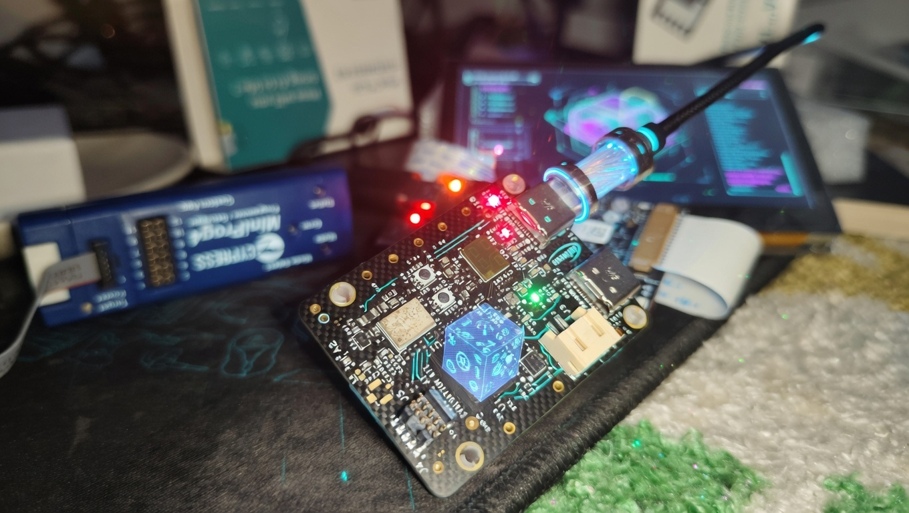

# PSoC™ 6 MQTT Client with Sensors


---

A ModusToolbox™ application for the Infineon **CY8CKIT-062S2-AI** (PSoC™ 6 AI Evaluation Board) that connects to Wi‑Fi and acts as an MQTT sensor node. It publishes **IMU** (accelerometer + gyroscope) and **magnetometer** data for motion/orientation/heading use cases, plus optional ENV telemetry, to configurable topics.

---



---


## Features

- **Wi‑Fi + MQTT** — Connects to a configurable broker (default: `broker.emqx.io`) over Wi‑Fi (WPA2).
- **Sensor publishing** — Periodically publishes on separate MQTT topics:
  - **ENV** — Temperature (real from BMI270 when available, else simulated) and simulated humidity.
  - **IMU** — Accelerometer and gyroscope (BMI270 or ICM-20948).
  - **MAG** — Magnetometer (BMM350 or BMM150).
- **Auto-detect sensors** — Probes common I2C addresses and supports BMI270/ICM-20948 and BMM350/BMM150.
- **Shared I2C** — Dedicated `i2c_driver` with mutex for thread-safe access by IMU and magnetometer.
- **Modular drivers** — `imu_driver`, `mag_driver`, `sim_driver` (simulated env), and optional real temperature from BMI270.

---

## Hardware

| Item | Description |
|------|-------------|
| **Board** | [CY8CKIT-062S2-AI](https://www.infineon.com/cms/en/product/evaluation-boards/cy8ckit-062s2-ai-psoc-6-ai-evaluation-board/) (PSoC™ 6 AI Evaluation Board) |
| **IMU** | BMI270 or ICM-20948 (I2C) |
| **Magnetometer** | BMM350 or BMM150 (shared I2C bus) |
| **Connectivity** | On-board Wi‑Fi (CYW43439), KitProg3 for programming/debug |

Schematic and block diagram links can be added under a `docs/` folder (e.g. `docs/assets/`, `docs/datasheet/`) if you maintain them in the repo.

---

## Prerequisites

- **ModusToolbox™** 3.x (with ModusToolbox IDE or standalone tools).
- **getlibs** — Run once to fetch Wi‑Fi and other dependent libraries:

  ```bash
  make getlibs
  ```

- **Wi‑Fi credentials** — Set your network in `configs/wifi_config.h` (see [Configuration](#configuration)).

---

## Configuration

### Wi‑Fi (`configs/wifi_config.h`)

Edit your network credentials here (replace the placeholder strings):

```c
#define WIFI_SSID "YOUR_SSID"
#define WIFI_PASSWORD "YOUR_PASSWORD"
```

| Macro | Description |
|-------|-------------|
| `WIFI_SSID` | Access point name |
| `WIFI_PASSWORD` | Passphrase |
| `WIFI_SECURITY` | e.g. `CY_WCM_SECURITY_WPA2_AES_PSK` |

### MQTT (`configs/mqtt_client_config.h`)

| Macro | Default | Description |
|-------|---------|-------------|
| `MQTT_BROKER_ADDRESS` | `broker.emqx.io` | Broker hostname (see alternatives below) |
| `MQTT_PORT` | `1883` | Broker port (non-TLS) |
| `MQTT_ENV_TOPIC` | `env` | Temperature/humidity |
| `MQTT_IMU_TOPIC` | `imu` | Accelerometer/gyroscope |
| `MQTT_MAG_TOPIC` | `mag` | Magnetometer |
| `MQTT_PUB_TOPIC` / `MQTT_SUB_TOPIC` | `ledstatus` | Demo control publish/subscribe topic |

Alternative public brokers (uncomment one in `configs/mqtt_client_config.h`):

- `test.mosquitto.org`
- `broker.emqx.io`
- `broker.hivemq.com`

---

## Build and program

From the project root:

```bash
# Fetch libraries (first time only)
make getlibs

# Build
make build

# Program the board (KitProg3)
make program
```

For a clean build:

```bash
make clean
make build
```

**Programming (KitProg3)**  
If `make program` fails with a CMSIS-DAP or “unable to find a matching CMSIS-DAP device” error:

1. Confirm the board is connected via USB and the KitProg3 port is visible.
2. Put the board in the correct link (e.g. “KitProg3 CMSIS-DAP” if your board has a link selector).
3. Try another USB port or cable; close other tools that might be using the probe.
4. See [ModusToolbox programming documentation](https://infineon.github.io/mtb-super-manifest/mtb_user_guide.html#programming-and-debugging) for your exact kit.

---

## Project structure

```
ps6-mqtt-client/
├── configs/
│   ├── mqtt_client_config.h   # Broker, topics, QoS
│   └── wifi_config.h         # SSID, password, security
├── source/
│   ├── main.c
│   ├── mqtt_task.c / .h
│   ├── publisher_task.c
│   ├── subscriber_task.c
│   ├── led_control_task.c
│   ├── led_sensor_task.c
│   └── sensors/
│       ├── sensor_task.c / .h # FreeRTOS task: ENV/IMU/MAG read & MQTT publish
│       ├── i2c_driver.c / .h  # Shared I2C bus + mutex
│       ├── imu_driver.c / .h  # BMI270 / ICM-20948 (accel, gyro, temperature)
│       ├── mag_driver.c / .h  # BMM350 / BMM150
│       └── sim_driver.c / .h   # Simulated temperature/humidity
├── Makefile
└── README.md
```

---

## MQTT topics and payloads

Publish interval is 1 s (see `SENSOR_PUBLISH_INTERVAL_MS` in `source/sensors/sensor_task.h`).

| Topic | Example payload |
|-------|------------------|
| `env` | `temperature=25.3,humidity=42` |
| `imu` | `ax=-0.60,ay=0.00,az=2.41,gx=-0.003,gy=0.007,gz=-0.017` |
| `mag` | `mx=515.6,my=1765.6,mz=421.8` |

- **ENV**: Temperature in °C (from BMI270 when available, else simulated); humidity in % (simulated).
- **IMU**: Accelerometer in m/s², gyroscope in rad/s.
- **MAG**: Magnetometer in µT (microtesla).

---

## Understanding IMU and MAG values

### IMU (`imu` topic)

The IMU payload is:

`ax, ay, az`: linear acceleration along the IMU axes (**m/s²**)  
`gx, gy, gz`: angular velocity about the IMU axes (**rad/s**)

Example:

`ax=-0.01,ay=-1.15,az=2.28,gx=-0.470,gy=-0.155,gz=-0.094`

- **Accelerometer (`ax/ay/az`)**:
  - When the board is stationary, the accelerometer measures **gravity**. The total magnitude should be close to **9.81 m/s²**:
    \[
    |a|=\sqrt{ax^2+ay^2+az^2}\approx 9.81
    \]
  - Each axis value is the component of gravity (plus any motion) along that axis. Which axis shows \( \pm 9.81 \) depends on how the board is oriented.
- **Gyroscope (`gx/gy/gz`)**:
  - `0 rad/s` means “not rotating”. Small non-zero readings are normal (noise/bias).
  - To convert to degrees/s: \( \text{deg/s} = \text{rad/s} \times 57.2958 \).

### MAG (`mag` topic)

The magnetometer payload is:

`mx, my, mz`: magnetic field along the sensor axes (**µT**)

Notes:
- Earth’s field magnitude is typically on the order of **25–65 µT** depending on location, but **nearby metal, magnets, USB cables, and current draw** can change readings significantly.
- When you rotate the board, the `mx/my/mz` components should change (the vector rotates with the sensor).

---


## References

- [CY8CKIT-062S2-AI product page](https://www.infineon.com/cms/en/product/evaluation-boards/cy8ckit-062s2-ai-psoc-6-ai-evaluation-board/)
- [ModusToolbox user guide](https://infineon.github.io/mtb-super-manifest/mtb_user_guide.html)
- [PSoC 6 technical reference](https://infineon.github.io/mtb-pdl-cat1/pdl_api_reference_manual/html/index.html)
